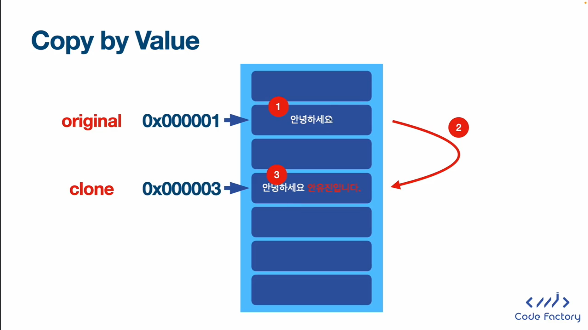
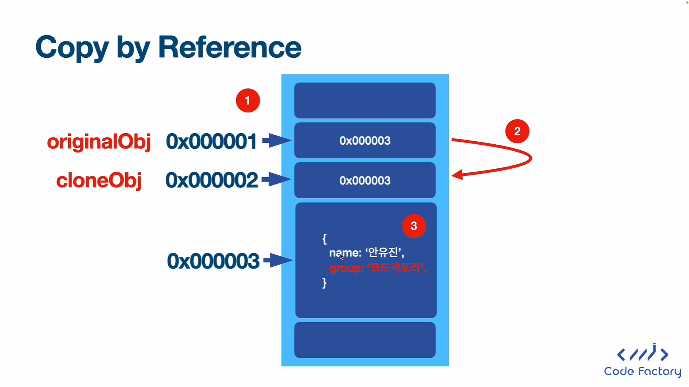

## Copy by Value와 Copy by Reference의 정의

### Copy by Value

값에 의한 전달

### Copy by Reference

참조에 의한 전달

### 규칙

1. 기본적으로 모든 primitive 값은 **Copy by Value**이다.
2. 객체는 **Copy by Reference**이다.

```javascript
let original = '안녕하세요'
let clone = original

console.log(original)
console.log(clone)
```

출력 결과

안녕하세요

안녕하세요

```javascript
clone += ' 안유진입니다.'
console.log(original)
console.log(clone)
```

출력 결과

안녕하세요

안녕하세요 안유진입니다.

```javascript
let originalObj = {
    name : '안유진',
    group : '아이브',
}
let cloneObj = originalObj

console.log(originalObj)
console.log(cloneObj)
```

출력 결과

{ name: '안유진', group: '아이브' }

{ name: '안유진', group: '아이브' }

```javascript
originalObj['group'] = '코드팩토리'
console.log(originalObj)
console.log(cloneObj)
```

출력 결과

{ name: '안유진', group: '코드팩토리' }

{ name: '안유진', group: '코드팩토리' }

```javascript
console.log(originalObj === cloneObj)
console.log(original === clone)
```

출력 결과

true

false

```javascript
originalObj = {
    name : '최지호',
    group : '코드팩토리',
}
cloneObj = {
    name : '최지호',
    group : '코드팩토리',
}
console.log(originalObj === cloneObj)
```

출력 결과

false

### 이해 사진





```javascript
const yuJin1 = {
    name : '안유진',
    group : '아이브',
}
const yuJin2 = yuJin1
const yuJin3 = {
    name : '안유진',
    group : '아이브',
}

console.log(yuJin1 === yuJin2)
console.log(yuJin1 === yuJin3)
console.log(yuJin2 === yuJin3)
```

출력 결과

true

false

false

## Spread Operator 복습

**Spread Operator**는 **array**에서만 존재하는 것이 아닌 **Object**에서도 존재한다. 또한 **Spread Operator**를 사용하면 **Copy by Value**가 된다.

```javascript
// Spread Operator
const yuJin4 = {
    ...yuJin3,
}
console.log(yuJin4)

console.log(yuJin4 === yuJin3)
```

출력 결과

{ name: '안유진', group: '아이브' }

false

**Spread Operator**를 사용한 후에도 **Object**에 값을 추가할 수 있다.

```javascript
const yuJin5 = {
    year : 2003,
    ...yuJin3,
}
console.log(yuJin5)
```

출력 결과

{ year: 2003, name: '안유진', group: '아이브' }

마지막으로 **Spread Operator**를 사용할 때 순서를 유의해야 한다.

```javascript
const yuJin6 = {
    name : '코드팩토리',
    ...yuJin3,
}
console.log(yuJin6)

const yuJin7 = {
    ...yuJin3,
    name : '코드팩토리',
}
console.log(yuJin7)

const numbers = [1, 3, 5]
const numbers2 = [
    10,
    ...numbers,
    11,
]
console.log(numbers2)
```

출력 결과

{ name: '안유진', group: '아이브' }

{ name: '코드팩토리', group: '아이브' }

[ 10, 1, 3, 5, 11 ]

전체 코드

```javascript
let original = '안녕하세요'
let clone = original

console.log(original)
console.log(clone)

console.log('----------------')

clone += ' 안유진입니다.'
console.log(original)
console.log(clone)

console.log('----------------')

let originalObj = {
    name : '안유진',
    group : '아이브',
}
let cloneObj = originalObj

console.log(originalObj)
console.log(cloneObj)

console.log('----------------')

originalObj['group'] = '코드팩토리'
console.log(originalObj)
console.log(cloneObj)

console.log('----------------')

console.log(originalObj === cloneObj)
console.log(original === clone)

console.log('----------------')

originalObj = {
    name : '최지호',
    group : '코드팩토리',
}
cloneObj = {
    name : '최지호',
    group : '코드팩토리',
}
console.log(originalObj === cloneObj)

console.log('----------------')

const yuJin1 = {
    name : '안유진',
    group : '아이브',
}
const yuJin2 = yuJin1
const yuJin3 = {
    name : '안유진',
    group : '아이브',
}

console.log(yuJin1 === yuJin2)
console.log(yuJin1 === yuJin3)
console.log(yuJin2 === yuJin3)

console.log('----------------')

// Spread Operator
const yuJin4 = {
    ...yuJin3,
}
console.log(yuJin4)

console.log(yuJin4 === yuJin3)

const yuJin5 = {
    year : 2003,
    ...yuJin3,
}
console.log(yuJin5)

console.log('----------------')

const yuJin6 = {
    name : '코드팩토리',
    ...yuJin3,
}
console.log(yuJin6)

const yuJin7 = {
    ...yuJin3,
    name : '코드팩토리',
}
console.log(yuJin7)

const numbers = [1, 3, 5]
const numbers2 = [
    10,
    ...numbers,
    11,
]
console.log(numbers2)
```