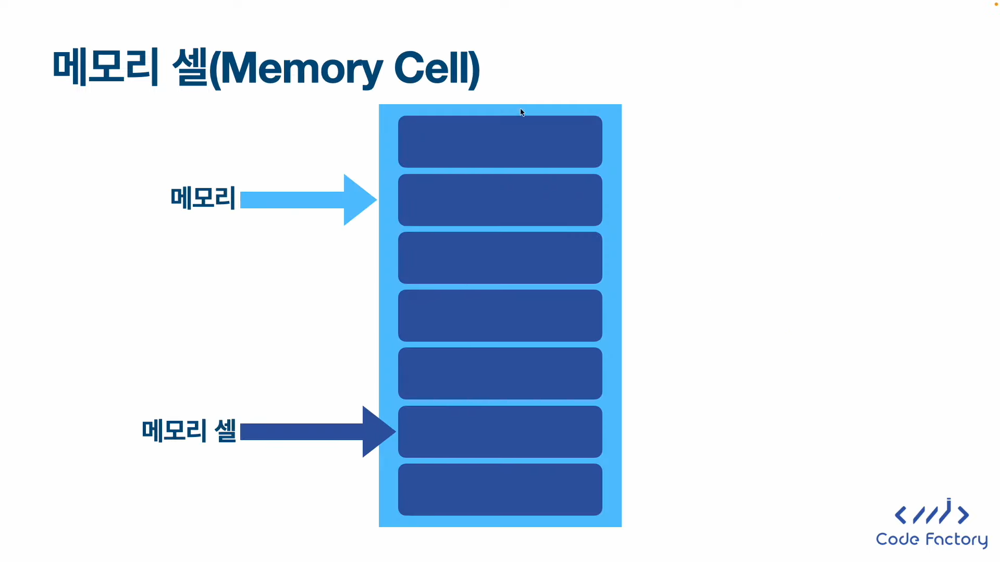
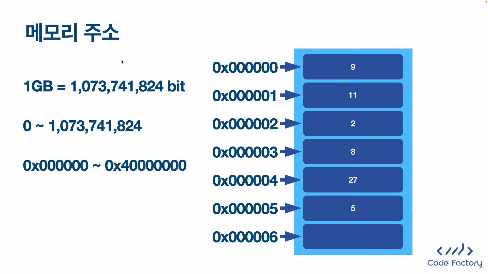
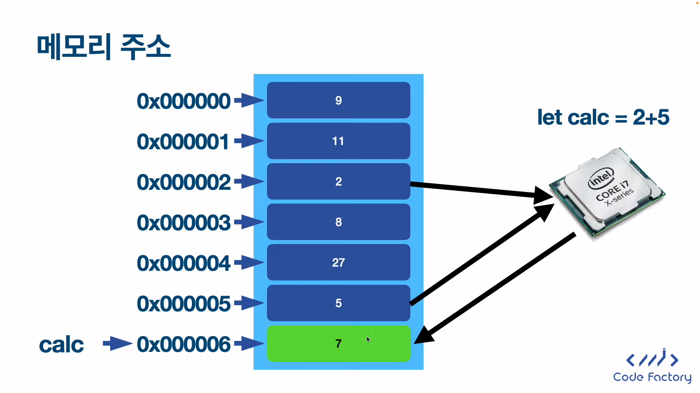

메모리: 우리가 데이터를 저장하는 공간

메모리는 기본적으로 셀 단위로 이루어져 있음

각각의 메모리 셀은 1바이트의 크기를 가지고 있다. 그래서 1바이트 이상의 데이터를 저장해야 한다면 여러 개의 메모리 셀을 사용해야 한다.

메모리 셀들은 각각 주소가 존재한다.

여기서 calc라는 변수 이름은 0x000006이라는 메모리 주소를 의미한다.

### 변수를 사용하는 이유

우리가 직접적으로 메모리 주소를 사용해서 모든 메모리 공간을 자유롭게 액세스하면 굉장히 위험하니 우리가 사용한 메모리 공간에 대한 이름을 붙여놓은 것이 변수이다. 프로그램을 작성한 그 안에서는 실제로 만들어낸 변수만 접근이 가능해서 위험하게 다른 프로그램에서 사용하고 있는 메모리 주소를 마음대로 접근하지 못한다.