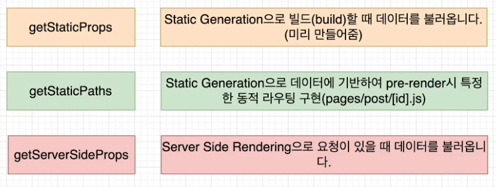

## Next.JS에서 데이터 가져오는 방법

**Next.JS**에서 데이터를 가져오는 방법을 여러가지가 있다. 그래서 애플리케이션의 사용 용도에 따라서 다른 방법을 사용해주면 된다.

보통 **React**에서는 데이터를 가져올 때 **useEffect**안에서 가져온다. 하지만 **Nextjs**에서는 다른 방법을 사용해서 가져온다.



## getStaticProps

```javascript
export async function getStaticProps(context) {
	return {
		props: {}, // will be passed to the page component as props
	}
}
```

- getStaticProps 함수를 async로 export 하면, getStaticProps에서 리턴되는 props를 가지고 페
이지를 pre-render 한다. build time에 페이지를 렌더링한다.

```javascript
// posts will be populated at build time by getStaticProps()
function Blog({ posts )} {
	return (
		<ul>
			{posts.map((post) => (
				<li>{post.title}</li>
			))}
		</ul>
	)
}

// This function gets called at build time on server-side.
// It won't be called on client-side, so you can even do
// direct database queries.
export async function getStaticProps() {
	// Call an external API endpoint to get posts.
	// You can use any data fetching library
	const res = await fetch('https://.../posts')
	const posts await res.json()
	// By returning { props: { posts } }, the Blog component
	// will receive 'posts' as a prop at build time
	return {
		props: {
			posts,
		},
	}
}
export default Blog
```

### getStaticProps를 사용해야 할 때

- 페이지를 렌더링하는 데 필요한 데이터가 사용자의 요청보다 먼저 build 시간에 필요한 데이터를 가져올 때
- 데이터를 Headless CMS에서 데이터를 가져올 때
- 데이터를 공개적으로 캐시할 수 있을 때(사용자별 아님)
- 페이지가 미리 렌더링되어야 하고(SEO의 경우) 매우 빨라할 때 (getStatic Props는 성능을 위해 CDN에서 캐시할 수 있는 HTML 및 JSON 파일을 생성한다.)

## getStaticPaths

```javascript
export async function getStaticPaths() {
	return {
		paths: [
			{ params: { ... }}
		],
		fallback: true // false or 'blocking'
	};
}
```

- 동적 라우팅이 필요할 때 getStaticPaths로 경로 리스트를 정의하고, HTML에 build 시간에 렌더링된다.
- **Nextjs**는 pre-render에서 정적으로 getStaticPaths에서 호출하는 경로들을 가져온다.

### paths

- 어떠한 경로가 pre-render 될지를 결정한다.
- 만약 pages/posts/[id].js 이라는 이름의 동적 라우팅을 사용하는 페이지가 있다면 아래와 같이
된다.

```javascript
return {
	paths: [
		{ params: { id: '1'}},
		{ params: { id: '2'}}
	],
	fallback: ...
}
```

- 빌드하는 동안 /post/1과 /post/2를 생성하게 된다.

### params

- -페이지 이름이 pages/posts/[postId]/[commentld] 라면, params은 postId와 commentid이다.
- 만약 페이지 이름이 pages/[...slug] 와 같이 모든 경로를 사용한다면, params는 slug가 담긴 배열이어야한다. ['postld', 'commentId"]

### fallback

- false 라면 getStaticPaths로 리턴되지 않는 것은 모두 404 페이지가 뜬다.
- true 라면 getStaticPaths로 리턴되지 않는 것은 404로 뜨지 않고, fallback 페이지가 뜨게
된다.

```javascript
// If the page is not yet generated, this will be displayed
	// initially until getStaticProps() finishes running
	if (router.isFallback) {
		return <div>Loading...</div>
	}
```

```javascript
// pages/posts/[id].js

function Post({ post }) {
	// Render post...
}

// This function gets called at build time
export async function getStaticPaths() {
	// Call an external API endpoint to get posts
	const res = await fetch('https://.../posts')
	const posts = await res.json()
	
	// Get the paths we want to pre-render based on posts
	const paths = posts.map((post) => ({
		params: { id: post.id},
	}))
	
	// We'll pre-render only these paths at build time.
	// { fallback: false } means other routes should 404.
	return { paths, fallback: false }
}

// This also gets called at build time
export async function getStaticProps({ params }) {
	// params contains the post `id`.
	// If the route is like /posts/1, then params.id is 1
	const res = await fetch('https://.../posts/${params.id}`)
	const post await res.json()
	
	// Pass post data to the page via props
	return { props: { post } }
}
export default Post
```

## getServerSideProps

```javascript
export async function getServerSideProps (context) {
	return {
		props: {}, // will be passed to the page component as props
	}
}
```

getServerSide Props 함수를 async로 export 하면, Next는 각 요청마다 리턴되는 데이터를
getServerSideProps로 pre-render한다.

```javascript
function Page({ data }) {
	// Render data...
}

// This gets called on every request
export async function getServerSideProps() {
	// Fetch data from external APΡΙ
	const res = await fetch(`https://.../data`)
	const data = await res.json()
	
	// Pass data to the page via props
	return { props: { data }}
}
export default Page
```

### getServerSideProps를 사용해야 할 때

요청할 때 데이터를 가져와야 하는 페이지를 미리 렌더해야할 때 사용한다. 서버가 모든 요청에 대한 결과를 계산하고, 추가 구성없이 CDN에 의해 결과를 캐시할 수 없기 때문에 첫 번째 바이트까지의 시간은 getStatic Props보다 느리다.