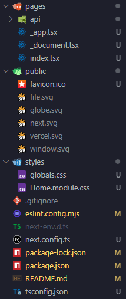

## pages

- 이 폴더 안에 페이지들을 생성한다.
- index.tsx가 처음 "/" 페이지로 된다.
- _app.tsx는 공통되는 레이아웃을 작성한다. 모든 페이지에 공통으로 들어가는 걸 넣어주려면 여기에 넣어주면 된다. (url을 통해 특정 페이지에 진입하기 전 통과하는 인터셉터 페이지이다.)
- 만약 about이라는 페이지를 만드려면 pages 폴더 안에 about.tsx를 생성해주면 된다.

## public

- 이미지 같은 정적(static) 에셋들을 보관한다.

## styles

- 말 그대로 스타일링을 처리해주는 폴더
- 모듈(module) css는 컴포넌트 종속적으로 스타일링하기 위한 것이며, 확장자 앞에 module을 붙여줘야 한다.

## next.config.js

- Next.JS는 웹팩을 기본 번들러로 사용한다. 그래서 웹팩에 대한 설정들을 이 파일에서 해줄 수 있다.