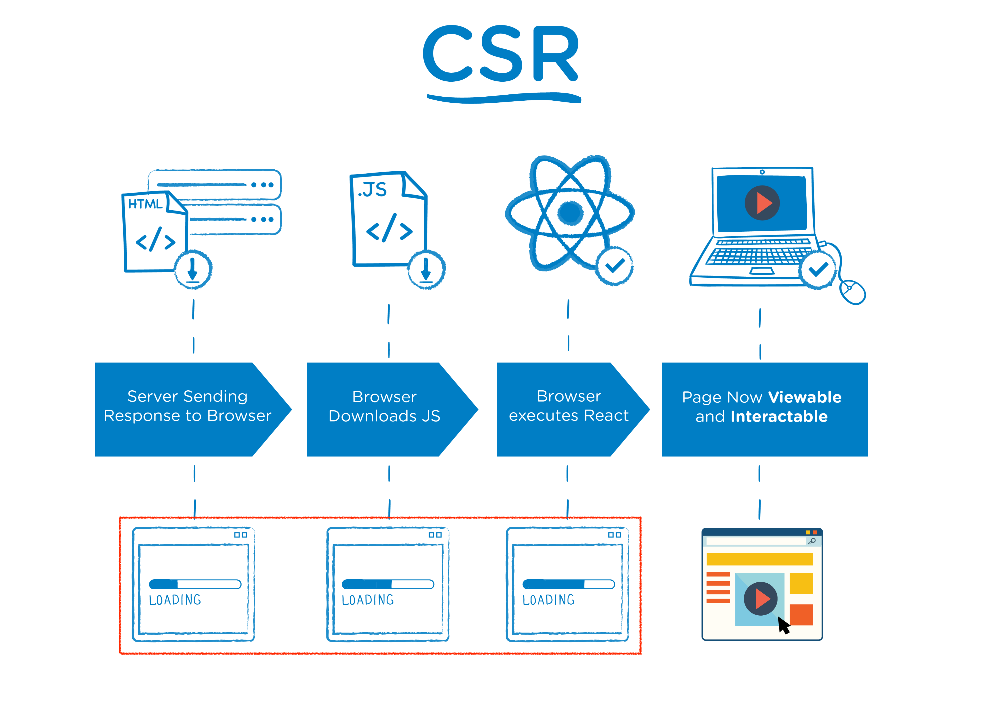
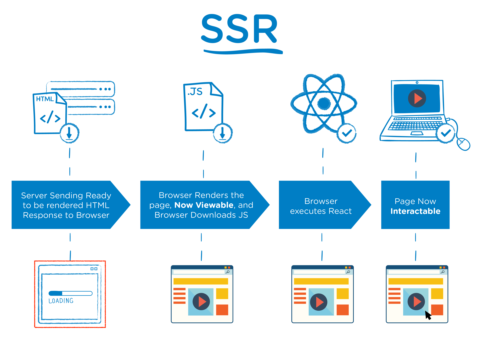

**React**의 **SSR**(Server Side Rendering)을 쉽게 구현할 수 있게 도와주는 간단한 **프레임워크**이다. (React는 라이브러리)

**React**로 개발할 때 **SPA**(Single Page Application)을 이용하며 **CSR**(Client Side Rendering)을 하기 때문에 장점이 있지만 단점도 있는데 그 부분이 바로 검색엔진 최적화(SEO) 부분이다.

**CSR**을 하면 첫 페이지에서 빈 html을 가져와서 JS파일을 해석하여 화면을 구성 하기 때문에 포털 검색에 거의 노출 될 일이 없다.
하지만 **Next.js**에서는 **Pre-Rendering**을 통해서 페이지를 미리 렌더링 하며 완성된 HTML을 가져오기 때문에 사용자와 검색 엔진 크롤러에게 바로 렌더링 된 페이지를 전달할 수 있게 된다.
**React**에서도 **SSR**을 지원하지만 구현하기에 굉장히 복잡하기 때문에 Next.js를 통해서 이 문제를 해결해주게 된다.





## SSR(Server Side Rendering)

### SSR이란?

- 클라이언트 대신 서버에서 페이지를 준비하는 원리이다.
- 원래 **React**에서는 **CSR**을 사용하기 때문에 서버에 영향을 미치지 않고, 서버에서 클라이언트로 응답해서 보낸 html도 거의 비어있다.
→ 이 방식은 서버에서 데이터를 가져올 때 지연 시간 발생으로 UX 측면에서 좋지 않을 수 있다.
→ 검색 엔진에 검색 시 웹크롤링이 동작할 때 내용을 제대로 가져와 읽을 수 없기에 검색엔진 최적화에 문제가 된다.
- **Next.js**에서는 **SSR**을 이용하므로 사용자와 검색 엔진 크롤러에게 바로 렌더링 된 페이지를 전달 할 수 있어서 검색엔진 최적화에 좋은 영향을 줍니다.

### 설치 방법

```powershell
npx create-next-app@latest

#or

yarn create next-app
```

```powershell
npx create-next-app@latest --typescript

#or

yarn create next-app --typescript
```